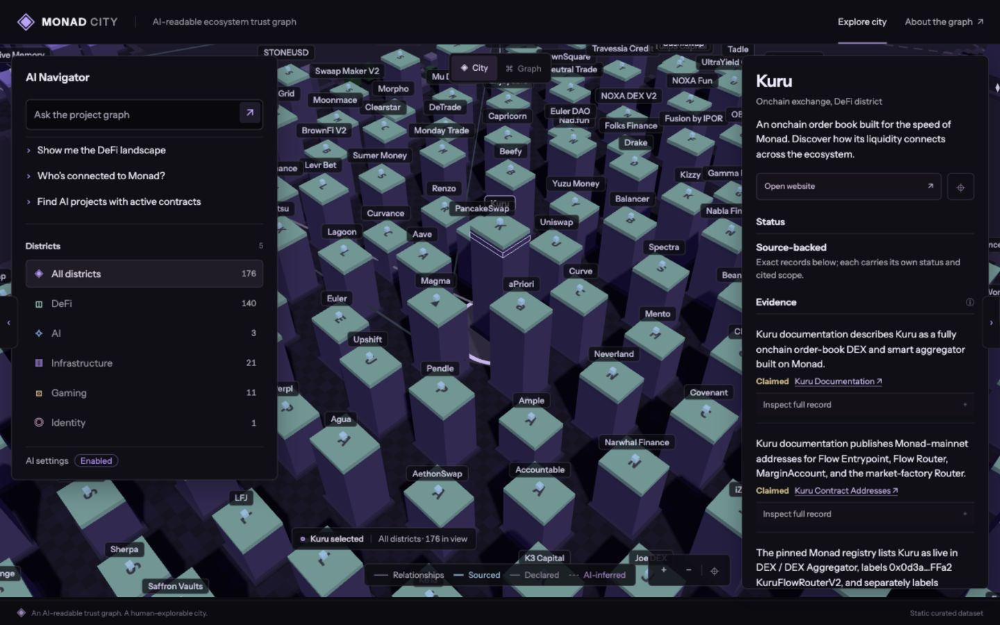

# Monad City

Explore the Monad ecosystem through an interactive city. Find projects, inspect their sources, and see how they connect.

[Open app](https://monad-city.vercel.app/)



## Features

- City and graph views with search and district filters.
- Project profiles with sources and relationship details.
- Navigator that finds projects and highlights them on the map.
- Optional AI agent that searches the project graph and selects relevant evidence.
- Onchain publication checks for exact evidence records on Monad Testnet.

Built with vanilla JavaScript, CSS, Three.js, and SVG.

## Getting started

Requires Node.js 18 or newer. No dependency installation is needed.

```sh
npm run dev
```

Open [localhost:5173](http://localhost:5173/).

## AI setup

Search works without an API key. To enable the AI agent, open **AI settings**, enter an OpenAI-compatible endpoint, a model that supports tool calling, and your API key, then click **Save AI settings**. The endpoint must allow requests from the browser (CORS).

Settings and the key are stored in your browser for the current site. AI requests, including queries and retrieved records, go directly to your chosen provider. Settings saved on localhost do not carry over to the hosted app.

## Development

```sh
npm run build     # validate the evidence snapshot and build dist/
npm run preview   # serve the built app
npm run test:ai   # run AI tests without external API calls
```

Project data comes from a checked-in snapshot. Sources support the specific claims shown; illustrative profiles and relationships are labeled. City layout and building size do not represent rankings.

See [AI Navigator](docs/AI_NAVIGATOR.md) and [Trust Model](docs/TRUST_MODEL.md) for details.

The optional evidence publication registry lives in [contracts](contracts/DEPLOYMENT.md).
The reviewed snapshot is published on Monad Testnet. Open a full evidence record and click **Check publication** to check its inclusion. This confirms publication, not source accuracy or project safety.
