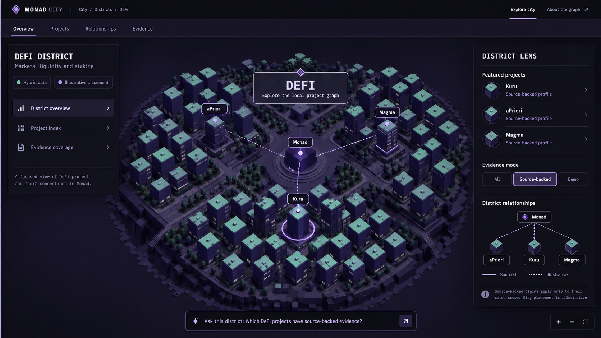

# Monad City — District Experience Specification

Status: product/UX implementation proposal, 2026-09-29  
Scope: dedicated district pages for DeFi, Infrastructure, AI, Gaming, and Identity  
Reference concept: `docs/concepts/defi-district-concept.png`



The concept image is a composition reference, not a literal copy contract. The implementation must
follow the current guidebook typography and trust-language rules. In particular, replace the
mockup's decorative `Hybrid data` / `Illustrative placement` chips with concise product-language
copy and functional evidence filters.

## 1. Purpose

Each district should become a focused way to explore one part of the ecosystem without turning
Monad City into five disconnected dashboards.

The district page is a scoped view of the same city and evidence graph:

- the city remains the primary interface;
- projects remain buildings;
- relationships remain typed, provenance-aware graph edges;
- Project Passport remains the source of project detail;
- AI Navigator searches the graph in the current district context;
- evidence status remains more important than decorative district identity.

A district is a navigational category. It is not official geography, ownership, endorsement,
ranking, or proof that two colocated projects integrate with one another.

## 2. Current runtime baseline

The current `src/main.js` project array produces the following district population:

| District | Current buildings | Accent | Glyph |
| --- | ---: | --- | --- |
| DeFi | 140 | `#9ad7c6` | `◫` |
| Infrastructure | 21 | `#aa8ae8` | `▥` |
| AI | 3 | `#91baff` | `✧` |
| Gaming | 11 | `#dbac80` | `⚄` |
| Identity | 1 | `#d89cc9` | `◎` |

These numbers are an implementation snapshot, not product copy. Every visible count must be
computed from the active project/evidence data. The UI must not hardcode `140`, `21`, or any other
district count.

The district experience must reuse the existing Three.js archipelago, Graph View, Project
Passport, deterministic Navigator, evidence snapshots, governance metadata, keyboard mirror, and
responsive shell. It must not create a second project dataset or a separate 3D scene per district.

### 2.1 Live interface inspection — 2026-09-29

The current app at `http://localhost:5173/` was inspected interactively before finalizing this
specification. The existing behavior is a strong foundation:

- district controls already live inside the expanded AI Navigator and display data-derived counts;
- selecting a district focuses its existing Three.js island and dims the rest of the archipelago;
- the same action currently auto-selects the first project in that district (`Kuru`, `Talus`, or
  `Moca Network` in the inspected examples) and immediately opens its Passport;
- City/Graph remains available after district focus;
- Graph View keeps the full ecosystem present and visually de-emphasizes out-of-scope nodes;
- mobile/narrow layout correctly presents the map before Navigator, district controls, and
  Passport content;
- the AI district is already a compact three-building island; Identity is truthfully represented
  by one building rather than filler projects;
- the keyboard mirror currently contains all project buildings even while one district is focused.

District pages should extend these working behaviors rather than replace them. The principal UX
change is to separate **district focus** from **project selection**: entering a dedicated district
route opens District Lens first. Passport opens only after the user selects a building, search
result, or relationship endpoint.

## 3. Product principles

### 3.1 The district is a lens, not a microsite

Entering a district changes camera scope, information hierarchy, filters, and Navigator context.
It does not take the user to a separate product with unrelated navigation.

### 3.2 The city remains dominant

On desktop the 3D district should occupy approximately 60–70% of the usable viewport. Panels
explain the city; they do not replace it. On mobile the city appears before long-form content.

### 3.3 District personality comes from structure

Each district gets a distinctive spatial grammar, density, landmarks, and wayfinding. Avoid
decorative skins that do not communicate project categories, graph structure, or navigation.

### 3.4 Colocation is not a relationship

Buildings may be grouped by normalized project type or capability for navigation. Proximity,
roads, plazas, or shared color must never imply an integration. Only a relationship record may
produce a relationship beam or Graph edge.

### 3.5 Evidence always wins over marketing

District copy may explain the navigational purpose of a category, but factual project claims must
come from the existing evidence model. District pages must preserve Observed, Claimed, Attested,
AI-inferred, illustrative, current, review-due, stale, unavailable, incomplete, and conflicting
semantics.

### 3.6 Uneven coverage is allowed

DeFi is currently much larger than Identity or AI. Do not fill smaller districts with fake
projects or decorative buildings that look like projects. Open space and an explicit coverage
note are more truthful than artificial density.

## 4. Navigation and routes

Use dependency-free hash routes so direct links work on the static server and do not require a
server-side fallback:

```text
#/city
#/district/defi/overview
#/district/defi/projects
#/district/defi/relationships
#/district/defi/evidence
```

Equivalent routes exist for `infrastructure`, `ai`, `gaming`, and `identity`.

### Entry points

- click or tap a floating district billboard in City View;
- select a district in the existing district filter and choose `Open district`;
- follow a district link from Navigator results;
- open a copied district URL;
- use browser Back to return to the previous city camera and selection.

### Header

District routes retain the existing global header and add a breadcrumb:

```text
City / Districts / DeFi
```

The four local tabs sit below the header:

```text
Overview   Projects   Relationships   Evidence
```

These are views of the same district state, not duplicated pages with independent selections.

## 5. Shared district page anatomy

### 5.1 Left panel — District identity

Reuse the current AI Navigator panel shell instead of adding a fourth independent panel. In
district scope its header and body become a contextual District Navigator containing:

1. district name and one-line purpose;
2. the existing Navigator search field with district context;
3. two or three district-specific suggested prompts;
4. current building count derived from data;
5. local navigation for the selected tab;
6. a concise placement disclosure.

Recommended disclosure copy:

```text
City placement is illustrative. Evidence states apply only to cited claims.
```

Do not add decorative `Demo`, `Hybrid`, `Live`, snapshot-version, or governance chips to the map
HUD. Detailed dataset disclosure stays in About/Evidence surfaces. Do not add a district trust
score, TVL leaderboard, token price, popularity rank, or unsupported activity metric.

### 5.2 Center — District city

Reuse the current Three.js scene and existing project meshes. District mode should:

- glide the camera to the selected island;
- keep the chosen district at normal opacity;
- dim other districts without deleting them;
- retain Monad as global orientation when it is in frame;
- use existing project selection, hover, label LOD, and keyboard behavior;
- show sourced relationship beams only when relationship visibility is on;
- never create decorative relationship beams.

The user must still be able to orbit and zoom. `Reset view` resets to the district framing while
the district route is active; `Return to city` restores the prior global camera.

On entry, the center may display a quiet district title plaque similar to the concept. It must not
obscure project labels and disappears after the first project selection or camera interaction.

### 5.3 Right panel — District Lens / Project Passport

With no project selected, the right panel is `District Lens`:

- featured or recently focused projects selected deterministically from data;
- functional evidence-mode control: `All`, `With cited evidence`, `Illustrative profiles`;
- compact local relationship graph;
- evidence coverage summary;
- explicit source/placement disclosure.

When a building is selected, the same panel becomes the existing Project Passport. A `Back to
district` action restores District Lens without clearing the district route.

`Featured` must not mean endorsed, ranked, safest, largest, or most active. A deterministic rule
should be visible in accessible copy, for example: selected Navigator matches first, then projects
with approved evidence, then alphabetical order.

### 5.4 Contextual AI Navigator

The Navigator remains deterministic and graph-grounded and stays in its current left-side shell on
desktop. The bottom search bar shown in the concept image is optional shorthand for narrow or
collapsed layouts, not a requirement to render two Navigator inputs. District mode passes a
district scope to retrieval:

```js
retrieveNavigator(query, {
  districtScope: 'DeFi',
  includeCrossDistrictRelationships: true,
});
```

Rules:

- ordinary capability/project queries prefer results inside the active district;
- explicit ecosystem-wide questions may return other districts and must say that scope expanded;
- relationship queries may include external projects when an evidence-backed edge crosses the
  district boundary;
- no-result and insufficient-evidence behavior stays conservative;
- selecting an answer focuses the correct building or relationship;
- answers cite evidence IDs and do not infer factual relationships from shared district/type.

The input placeholder is contextual:

```text
Ask this district…
```

### 5.5 Local Graph View

City/Graph remains a global toggle inside district routes:

- City shows the focused Three.js island;
- Graph shows the district subgraph plus directly connected external nodes;
- external nodes use reduced opacity and an `Outside district` label;
- an edge is never hidden merely because its other endpoint belongs to another district;
- `Expand to ecosystem` restores the full graph without leaving the route.

The current Graph already keeps all out-of-district nodes dimmed after a district filter. D1 may
reuse that behavior. The dedicated Relationships tab should later tighten the default graph to
in-district nodes plus direct external endpoints so DeFi does not render 176 interactive labels at
once.

## 6. Shared tabs

### Overview

Purpose: understand the district in one screen.

- focused city island;
- district identity and data coverage;
- a small set of deterministic project entry points;
- compact local relationship graph;
- contextual Navigator prompt.

### Projects

Purpose: find a project without replacing spatial navigation with a generic directory.

- city remains visible;
- project index appears in District Lens or a quiet bottom drawer;
- filters derive from normalized project types/capabilities;
- sorting defaults to alphabetical;
- source-backed coverage is a filter, not a ranking;
- each result focuses its building and opens Passport;
- unknown/unmapped types go into `Other`, never disappear.

### Relationships

Purpose: inspect connections and their provenance.

- opens local Graph View by default;
- shows sourced, publisher-claimed, third-party-attested, AI-inferred, and illustrative classes
  according to the existing model;
- filters by relationship type and evidence state;
- selecting an edge exposes exact evidence IDs, scope, source, timestamp, provenance, limitations,
  and review state;
- a zero-edge district displays an honest empty state instead of generated suggestions.

### Evidence

Purpose: understand what is known, how it is known, and what is missing.

- summary counts are derived from the active snapshot and governance companion;
- records group by project and retain exact evidence type/status;
- source publisher, URL, retrieved/published timestamps, network, scope, provenance, limitations,
  quality flags, review status, next review, and evidence ID remain inspectable;
- filters: `All`, `Observed`, `Claimed`, `Attested`, `AI-inferred`, `Demo`, `Review due`, `Warnings`;
- no district-level badge may imply that the district itself is verified.

## 7. District configuration contract

Create a new static configuration module such as `src/districts.js`. It contains presentation and
navigation rules only; factual project/evidence data remains in the existing data path.

```js
export const DISTRICT_EXPERIENCES = {
  DeFi: {
    slug: 'defi',
    glyph: '◫',
    accent: '#9ad7c6',
    title: 'DeFi District',
    subtitle: 'Markets, liquidity and staking',
    layout: 'dense-financial-core',
    clusters: [
      { id: 'trading', label: 'Trading', matchTypes: [] },
      { id: 'credit', label: 'Credit', matchTypes: [] },
      { id: 'yield', label: 'Yield & staking', matchTypes: [] },
      { id: 'assets', label: 'Assets & payments', matchTypes: [] },
    ],
    prompts: [],
  },
};
```

Rules:

- configuration contains no counts;
- cluster matching uses normalized type/capability values;
- configuration does not create relationships;
- accents identify districts, not evidence/trust state;
- trust-state colors retain their existing meaning inside every district;
- missing cluster matches fall back to `Other`;
- UI copy is English even if planning documentation is Russian.

## 8. DeFi District

### Product role

Help users navigate a very dense set of market, liquidity, credit, staking, asset, and allocation
projects without presenting financial rankings or recommendations.

### Exact UI copy

```text
DEFI DISTRICT
Markets, liquidity and staking
Explore protocols by capability, connection and available evidence.
```

### Spatial grammar

- densest skyline in the city;
- a central market/plaza provides orientation, not a claim of protocol importance;
- four legible urban quarters: Trading, Credit, Yield & staking, Assets & payments;
- wider streets separate quarters so 140+ buildings remain readable;
- selected and Navigator-matched buildings keep name labels; other labels follow current LOD;
- building height must not encode TVL, safety, popularity, or endorsement unless an explicit future
  metric and source contract is approved.

### Suggested type mapping

| Cluster | Example normalized types |
| --- | --- |
| Trading | DEX, Dexs, DEX Aggregator, Derivatives, Trading Interfaces, Prediction Market |
| Credit | Lending, CDP, Uncollateralized Lending, Risk Curators |
| Yield & staking | Yield, Yield Aggregator, Liquid Staking, Liquid Restaking, Onchain Capital Allocator |
| Assets & payments | RWA, Stablecoin, Payments, Asset Issuers, Neobanks |

Launchpads, liquidity automation, cross-chain products, and unmatched values may use `Other` until
the normalization contract assigns them. Mapping is navigational and does not assert integration.

### District Lens priorities

1. selected/Navigator-matched projects;
2. projects with approved source-backed evidence;
3. type coverage across the four quarters;
4. alphabetical fallback.

### Navigator prompts

```text
Which DeFi projects have source-backed evidence?
Show lending projects and their available evidence.
Show sourced relationships in DeFi.
Compare DEX and staking projects by evidence coverage.
```

`Compare` means compare available evidence/type/relationships, never financial performance,
returns, safety, or recommendation.

### Special QA risks

- label overload at 140+ buildings;
- accidental ranking through height or central placement;
- too many relationship beams at rest;
- unsupported financial language;
- poor frame rate when filters and labels update together.

## 9. Infrastructure District

### Product role

Show the services and connective layers other projects may depend on, while requiring evidence for
every displayed dependency or integration.

### Exact UI copy

```text
INFRASTRUCTURE DISTRICT
Networks, data and connective services
Trace the systems and sourced links that support the ecosystem graph.
```

### Spatial grammar

- a hub-and-spoke island with clear paths between service clusters;
- taller relay/data towers create orientation;
- shoreline ports may represent navigation to cross-chain categories, but never a factual bridge
  relationship by themselves;
- actual integration/dependency beams appear only from relationship records;
- avoid decorative bridges because bridges visually imply connectivity.

### Suggested type mapping

| Cluster | Example normalized types |
| --- | --- |
| Network & execution | Layer 1 network, RPC, validator tooling, developer tooling |
| Data & oracles | Oracle infrastructure, Price oracle, Data, indexing |
| Interoperability | Bridge, Cross Chain Bridge, Interoperability |
| Privacy & security | Privacy, Privacy / Encryption, security tooling |
| Other services | unmatched infrastructure-adjacent types with explicit labels |

### District Lens priorities

- cross-district relationships are more important here than visual density;
- show `Connected districts` only from actual relationship endpoints;
- separate a project's documented capability from an observed integration;
- do not turn directory membership into proof of active infrastructure usage.

### Navigator prompts

```text
Which infrastructure projects have source-backed evidence?
Show oracle projects and their cited scope.
Which sourced relationships cross into DeFi?
Show infrastructure records with review warnings.
```

### Special QA risks

- decorative paths being mistaken for integrations;
- project documentation being presented as onchain activity;
- cross-district nodes disappearing from the local Graph;
- district accent purple colliding with AI-inferred violet semantics.

## 10. AI District

### Product role

Help users inspect the small current set of AI/agent projects, their stated capabilities, and their
dependencies without presenting AI-inferred categorization as fact.

### Exact UI copy

```text
AI DISTRICT
Agents, models and intelligent services
Explore a limited district through capabilities, sources and graph context.
```

### Spatial grammar

- a compact research campus with generous open space;
- one central lab plaza and small satellite buildings;
- no filler structures that resemble real projects;
- project state and evidence coverage matter more than skyline height;
- cross-district dependencies may remain visible when they have relationship records.

### Suggested type mapping

| Cluster | Example normalized types |
| --- | --- |
| Agent infrastructure | AI agent infrastructure, agent tooling |
| Consumer AI | Consumer AI, assistants, applications |
| Data & execution dependencies | shown only through sourced relationships, not inferred from category |

### District Lens priorities

- lead with the limited coverage state rather than filling empty space;
- show whether a capability is publisher-claimed, source-observed, or AI-inferred;
- provide an honest empty state for evidence/relationship filters;
- do not call the deterministic Navigator itself an AI project in this district.

### Navigator prompts

```text
Show AI projects and their evidence states.
Which AI capabilities are publisher-claimed?
Show sourced AI relationships outside this district.
What information is missing for AI projects?
```

### Special QA risks

- AI-inferred classification being styled as verified fact;
- a sparse district appearing broken;
- generic chatbot UI overwhelming the map;
- fabricated dependencies added to make the graph look richer.

## 11. Gaming District

### Product role

Provide a legible map of games, studios, marketplaces, and mobile-first experiences while keeping
illustrative prototype entities unmistakably separate from source-backed projects.

### Exact UI copy

```text
GAMING DISTRICT
Games, worlds and player experiences
Discover projects and inspect the evidence behind their ecosystem connections.
```

### Spatial grammar

- a civic entertainment quarter with several small plazas rather than one casino-like center;
- venue-shaped silhouettes may distinguish games, studios, and marketplaces;
- warm amber accent is restrained to wayfinding and selection support;
- avoid slot-machine language, flashing neon, token-price motifs, or gamified trust scores;
- illustrative fictional projects must retain explicit Demo treatment.

### Suggested type mapping

| Cluster | Example normalized types |
| --- | --- |
| Games | Games, Luck Games |
| Studios & platforms | Game studio, Onchain arcade, Mobile-First |
| Markets | Marketplace, NFT Marketplace |
| Other | unmatched entertainment/community categories |

### District Lens priorities

- source-backed and Demo projects must be separable with one control;
- connection to randomness, identity, marketplaces, or infrastructure appears only when supported
  by a relationship record;
- selected Demo entities explain that their profiles are illustrative.

### Navigator prompts

```text
Show source-backed projects in Gaming.
Which Gaming projects are illustrative Demo entries?
Show sourced relationships leaving the Gaming district.
What evidence is available for Gaming projects?
```

### Special QA risks

- fictional Demo projects appearing real;
- visual entertainment motifs overpowering evidence status;
- unsupported claims about ownership, rewards, or player identity;
- inferred links to oracle/randomness providers appearing sourced.

## 12. Identity District

### Product role

Explain identity and reputation projects and their ecosystem context without implying that Monad
City has authenticated users, wallets, organizations, or project legitimacy.

### Exact UI copy

```text
IDENTITY DISTRICT
Identity, reputation and access
Inspect a small, evidence-aware view of identity-related projects.
```

### Spatial grammar

- a compact gateway pavilion rather than an artificially populated island;
- the single current building remains clearly selectable and proportionate;
- open space communicates limited coverage;
- gates, paths, or rings are navigation motifs only and must not imply authentication;
- future buildings enter only through the normal intake/evidence workflow.

### Suggested type mapping

| Cluster | Example normalized types |
| --- | --- |
| Identity | Digital identity, identity primitives |
| Reputation | reputation/credential capabilities when supported by project data |
| Access | access/authorization capabilities when supported by project data |

Do not create empty cluster buildings. Hide empty cluster navigation and disclose limited coverage.

### District Lens priorities

- evidence and limitation disclosure come before relationships;
- avoid words such as `verified identity`, `trusted`, or `authenticated` unless an exact evidence
  object supports that precise bounded claim;
- wallet control, reviewer identity, project identity, and legitimacy remain separate concepts.

### Navigator prompts

```text
Show identity projects and their evidence states.
What claims are source-backed in Identity?
Show sourced relationships for Identity projects.
What information is missing in this district?
```

### Special QA risks

- sparse coverage being hidden by decoration;
- UI language implying user authentication or project legitimacy;
- a district name being mistaken for a verified identity service;
- missing relationships being replaced with speculative edges.

## 13. State model

Extend the UI state without changing evidence semantics:

```js
const state = {
  // existing state
  selectedProjectId: null,
  viewMode: 'city',
  districtFilter: 'All districts',

  // district experience
  scope: 'city', // 'city' | 'district'
  activeDistrict: null,
  districtTab: 'overview',
  districtEvidenceMode: 'all', // 'all' | 'source-backed' | 'demo'
  districtTypeFilter: null,
  previousCityCamera: null,
};
```

State rules:

- entering a district stores the previous global camera;
- entering from an out-of-district selection clears project selection and opens District Lens;
- entering while an already selected project belongs to the district may preserve that selection;
- unlike the current filter shortcut, route entry must not automatically choose the first project;
- tab changes retain district, camera, and selected project;
- selecting a project opens Passport without leaving district scope;
- selecting a cross-district relationship may frame both endpoints while keeping the district
  breadcrumb;
- leaving district scope restores the prior global camera and retains the selected project;
- a hash route is the source of truth for scope/tab, while transient camera/hover state stays in
  memory;
- invalid district/tab slugs fall back to `#/city` with no crash.

## 14. Data-derived selectors

Add pure selector functions rather than duplicating arrays:

```js
getDistrictProjects(projects, district)
getDistrictRelationships(relationships, districtProjectIds, { includeExternal: true })
getDistrictEvidence(evidenceRecords, districtProjectIds)
getDistrictCoverage({ projects, evidenceRecords, relationships, governanceRows })
getDistrictTypes(projects, districtConfig)
getDistrictFeaturedProjects({ projects, evidenceByProject, navigatorMatches })
```

Coverage should expose plain facts such as:

- total displayed projects;
- projects with at least one approved evidence record;
- Demo-only profiles;
- sourced relationships;
- illustrative/AI-inferred relationships;
- current/review-due evidence subjects;
- warning-bearing evidence records.

Coverage must not collapse these facts into a score or label a district healthy, safe, verified,
active, official, or complete.

## 15. File-level implementation plan

### New file: `src/districts.js`

- presentation configuration for five districts;
- slug/name lookup;
- English copy, accent, glyph, cluster normalization, suggested prompts;
- pure selectors may live here or in `src/district-selectors.js` if the file becomes large.

### `src/main.js`

- hash-route parser/serializer;
- district scope state and render orchestration;
- common District Lens rendering;
- shared tab rendering;
- Project Passport transition/back behavior;
- decoupling the existing district-focus action from automatic first-project selection when a
  dedicated district route is entered;
- contextual Navigator options;
- data-derived counts and filters;
- accessible tab/route controls.

Do not create five copied render functions. One common renderer consumes district configuration.

### `src/city3d.js`

Build on the existing `focusIsland(district)` behavior and expose a stable public API:

```js
city3d.enterDistrict(district, { animate: true });
city3d.leaveDistrict({ restoreCamera: true });
city3d.setDistrictClusterFilter(clusterId);
city3d.getCameraSnapshot();
city3d.restoreCamera(snapshot);
```

- reuse existing scene and meshes;
- add optional subcluster framing only after normalized cluster mapping is stable;
- update opacity/labels without rebuilding geometry;
- keep `prefers-reduced-motion` behavior;
- pause rendering in Graph View as today.

### `src/retrieval.js`

- accept optional district scope;
- rank in-scope results first;
- preserve cross-district relationship endpoints;
- make scope expansion explicit in answer templates;
- retain evidence citations, uncertainty, unsupported, insufficient-evidence, and no-result states;
- never infer a relationship from cluster membership.

### `src/style.css`

- district breadcrumb and local tab row;
- quiet District Lens layout;
- responsive bottom-sheet behavior;
- accent via CSS custom property such as `--district-accent`;
- do not reuse district accent as evidence-status color;
- preserve current guidebook typography contract.

### Evidence/data files

No evidence snapshot, governance companion, source claim, review status, or relationship should be
changed merely to build district pages. District configuration is presentation metadata only.

## 16. Desktop layout

Target: 1440 × 900 and wider.

```text
┌──────────────── Global header / breadcrumb ────────────────┐
│ Overview  Projects  Relationships  Evidence                │
├───────────────┬──────────────────────────────┬──────────────┤
│ District      │                              │ District Lens│
│ identity      │     focused 3D district      │ or Passport  │
│ and local nav │                              │              │
│               │ contextual Navigator         │              │
└───────────────┴──────────────────────────────┴──────────────┘
```

- left panel: approximately 260–300px;
- right panel: approximately 300–340px;
- panels may collapse independently;
- city keeps the remaining width and full available height;
- local tabs do not consume a large hero header;
- at widths where both panels compromise the city, collapse the left District Navigator first.

## 17. Mobile layout

Target: 390 × 844.

Order:

1. global header and compact breadcrumb;
2. horizontally scrollable local tabs inside the viewport;
3. city canvas, at least 52–58vh on Overview;
4. compact contextual Navigator bar;
5. District Lens as a bottom sheet;
6. Project Passport replaces the sheet content after selection.

Rules:

- no page-level horizontal overflow;
- the current map-first order is preserved and the city appears before evidence lists;
- tab bar uses scroll snapping but remains keyboard accessible;
- sheet has collapsed, half, and full states;
- selecting a building opens the half sheet, not a full-screen takeover immediately;
- browser Back closes Passport first when appropriate, then leaves the district;
- controls have at least 44 × 44px touch targets;
- orbit/pan gestures must not trap page scrolling outside the canvas;
- reduced motion removes camera flights and sheet spring effects.

## 18. Accessibility

- local tabs use `role="tablist"`, `role="tab"`, `aria-selected`, and associated tab panels;
- Left/Right arrows change tabs; Enter/Space activates controls;
- breadcrumb and `Return to city` are real links/buttons;
- district billboard sprites retain DOM-equivalent accessible controls;
- building selection continues to use the hidden keyboard project list; in district scope that
  list contains only in-scope projects plus currently exposed cross-district endpoints rather than
  all 176 projects;
- focus returns to the originating district control when leaving the route;
- evidence state is communicated by text, not color alone;
- relationship line style has a text legend;
- empty/sparse districts have explicit copy, not only empty visuals;
- all camera animation respects `prefers-reduced-motion`.

## 19. Motion

Use motion only to explain scope and selection:

- enter district: 450–700ms camera frame transition;
- tab changes: no camera motion unless the view changes City ↔ Graph;
- project selection: existing focus flight and one selection ring;
- relationship selection: source-to-target beam emphasis;
- Navigator result: existing match beacons and camera framing;
- leave district: restore previous camera;
- reduced motion: instant framing with a short opacity state change only.

No idle building motion, constant glow, pulsing district labels, decorative traffic, or automated
camera tours.

## 20. Delivery sequence

### D1 — Shared route and state foundation

- add district configuration and hash routing;
- connect the existing district billboard/filter behavior to `enterDistrict` while preserving a
  separate quick-filter action if needed;
- stop dedicated route entry from auto-opening the first project Passport;
- implement breadcrumb, tabs, return-to-city behavior;
- preserve current City/Graph, selection, filters, and browser Back.

Exit: all five routes load safely and focus the correct existing island.

### D2 — Shared Overview and District Lens

- add common identity and lens panels;
- data-derived counts and evidence modes;
- Passport transition/back behavior;
- implement DeFi visual treatment first as the reference district.

Exit: DeFi matches the approved concept hierarchy without hardcoded counts or new claims.

### D3 — Projects, Relationships, and Evidence tabs

- project type filters;
- local Graph subgraph with external endpoints;
- evidence and governance inspection;
- empty states for sparse/no-evidence cases.

Exit: every visible relationship/evidence item resolves to its existing record.

### D4 — Contextual Navigator

- district-aware ranking and prompts;
- scope-expansion explanation;
- map/graph focus synchronization;
- conservative no-result behavior.

Exit: Navigator answers focus the same projects/relationships they cite.

### D5 — Four remaining district personalities

- Infrastructure spatial hierarchy and cross-district context;
- AI sparse campus treatment;
- Gaming venue treatment with Demo separation;
- Identity compact gateway and limited-coverage state.

Exit: the five pages feel distinct without five duplicated implementations.

### D6 — Responsive, accessibility, performance, QA

- mobile sheet and tab behavior;
- keyboard/focus restoration;
- reduced motion;
- label and beam budgets;
- desktop/mobile/browser regression.

Exit: acceptance matrix below passes.

## 21. Acceptance matrix

### Shared behavior

- each floating district button opens the matching route and island;
- browser Back returns to the prior city camera;
- Overview/Projects/Relationships/Evidence preserve selection and district scope;
- Project Passport opens from every district and returns to District Lens;
- City/Graph works inside every district;
- district filter, global search, relationship visibility, zoom, reset, and keyboard selection
  remain functional;
- counts derive from active data;
- the district keyboard mirror does not expose all out-of-scope buildings as sequential controls;
- no new factual relationship exists without evidence IDs;
- Demo and source-backed states remain distinguishable;
- no trust score or endorsement language appears.

### District-specific

- DeFi remains navigable and performant with 140+ buildings;
- Infrastructure keeps sourced cross-district connections visible and does not use decorative
  relationship bridges;
- AI shows limited coverage without fake density;
- Gaming keeps illustrative fictional projects visibly Demo;
- Identity shows one real configured building without generating placeholders that look factual.

### Desktop/mobile

- desktop 1440 × 900 and 1280 × 720 have no panel overlap or page overflow;
- mobile 390 × 844 shows city first and has no horizontal overflow;
- touch targets and sheet gestures work;
- keyboard users can enter/leave a district, switch tabs, select projects, and return focus;
- no console errors or unhandled hash routes;
- Graph View pauses the Three.js render loop;
- current frame-rate budget does not regress materially in DeFi.

### Trust and retrieval

- district placement is described as illustrative navigation;
- shared cluster membership never creates an edge;
- every sourced answer cites existing evidence IDs;
- review-due does not become stale automatically;
- unavailable/conflicting/incomplete states remain visible;
- unsupported, insufficient-evidence, and no-result queries remain conservative;
- district pages never imply official Monad endorsement, financial safety, active usage, identity
  verification, or project legitimacy.

## 22. Explicit non-goals

This implementation does not add:

- a backend, live indexer, crawler, wallet, or external LLM;
- token prices, trading, TVL ranking, yield recommendations, or portfolio functionality;
- official district ownership or project endorsement;
- auto-generated relationships from visual proximity;
- separate datasets or duplicated pages for each district;
- fake projects to fill sparse districts;
- a generic chatbot transcript;
- a new evidence snapshot solely for presentation work.

## 23. Recommended first implementation task

Build D1 and D2 for DeFi only, but implement them through the shared district configuration and
route system. Verify that the same common shell can open Infrastructure, AI, Gaming, and Identity
with their own copy/accent before adding district-specific spatial details.

This avoids a polished one-off DeFi page that later has to be rewritten five times.
