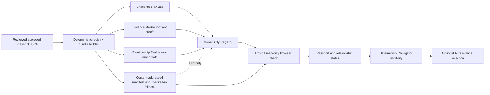

# Monad City — Onchain Evidence Registry Architecture

Status: final architecture; local implementation accepted; external deployment pending, 2026-10-10  
Target namespace: `monad-city:registry:main:v1`  
Target snapshot: `phase-3.5-v6`  
Target snapshot canonical SHA-256: `9529251e87f2f713391122e1c1373c666ed83dac97c42f5e5ddde685b94e6b3b`  
Portable snapshot ID: `0x7c9d1211d600742ac6b34e64f53410742f156bb953f602756b12f6b1f4ac54c3`  
Evidence root/count: `0x5eb0597c4b583f148e760d749dd75f38c54ddce2dffeba1280b5b3500a1cb35e` / 193  
Relationship root/count: `0xa21b45b628eb8c4b1842900ccd6bdc0b5d2728e974bcf734e695c79e5f29e930` / 6

## 1. Decision and trust boundary

Monad City should use an immutable, non-upgradeable registry contract to publish compact
commitments to reviewed evidence snapshots. The contract commits to:

- the exact approved snapshot JSON digest;
- separate Merkle roots and counts for evidence records and relationships;
- an immutable, linear publication history;
- the address that published each version;
- snapshot and subject-ID revocations;
- an offchain manifest location and the hash of that location; and
- predecessor/successor deployment bindings for explicit contract migration.

The registry does **not** determine whether a source is correct, current, safe, legitimate,
official, or endorsed. An active anchor means only:

> The recorded publisher address committed this exact snapshot and these inclusion roots in this
> registry deployment, and no applicable onchain revocation was visible at the block inspected.

Review approval remains eligibility for one bounded record. Publishing that approval onchain does
not turn it into global project verification. Existing `Observed`, `Claimed`, `Attested`, and
`AI-inferred` meanings remain unchanged.

No contract is currently deployed. No repository value may imply a live address, transaction,
publisher, block, or chain verification until a deployment has happened and the complete trust
binding in section 8.2 has been reviewed and pinned.

## 2. Why this is the final registry shape

This design supports the complete publication lifecycle without adding unrelated protocol scope:

- one whole-snapshot commitment for reproducible release identity;
- individual evidence and relationship inclusion proofs;
- permanent, queryable history rather than a moving `latest` value;
- separate supersession and revocation states;
- namespace, content-kind, snapshot, chain, and deployment domain separation;
- least-privilege publisher and revoker roles with delayed two-step admin rotation;
- a proxy-free migration path;
- content-addressable offchain artifacts with local checked-in fallback; and
- a dependency-free browser verifier using WebCrypto SHA-256 and raw JSON-RPC.

It deliberately excludes tokens, fees, custody, voting, project self-registration, wallet claim
flows, mutable proxy logic, source scraping, automated approval, and transaction execution from the
application. Those features do not strengthen this registry's evidence commitment.

## 3. System layers



The approved snapshot remains the source payload. The bundle adds hashes and proofs but cannot
alter a record, relationship, review decision, source, limitation, or claim state. The contract
stores commitments and lifecycle state, not the full evidence text.

## 4. Exact canonical data contract

### 4.1 Canonical JSON

The registry uses **Monad City canonical JSON v1**, the existing repository algorithm:

1. Input must be parsed JSON data only.
2. Object keys are recursively sorted with JavaScript's default `Object.keys(value).sort()` order,
   which is lexicographic UTF-16 code-unit order.
3. Array element order is preserved exactly.
4. The sorted value is serialized with `JSON.stringify(value, null, 2)`.
5. One line-feed byte (`0x0a`) is appended.
6. The resulting string is encoded as UTF-8 before hashing.

This format is intentionally the existing repository format. It is **not** RFC 8785 / JCS.
Implementations in another language must match the checked-in test vectors byte for byte.

The whole snapshot digest is:

```text
snapshotSha256 = SHA-256(canonicalJson(snapshotEnvelope))
```

The current immutable v6 digest remains:

```text
9529251e87f2f713391122e1c1373c666ed83dac97c42f5e5ddde685b94e6b3b
```

No approved snapshot or generated runtime module is rewritten to create the registry bundle.

### 4.2 Namespace and domain constants

All values below are raw 32-byte SHA-256 results of the exact UTF-8 strings. The implementation
exports the resulting bytes32 constants and the unhashed strings so independent clients can
recompute them.

| Purpose | Exact UTF-8 input | SHA-256 bytes32 |
|---|---|---|
| Namespace | `monad-city:registry:main:v1` | `0x07715c605c9d90b28bad5a413c4797b590db4bad65e2725355e62cca3c62d959` |
| Snapshot ID domain | `monad-city:registry:snapshot-id:v1` | `0x62381c337ff733f22ed1a2729474028c3579d30b1c79bd46d999510ac96668bf` |
| Deployment ID domain | `monad-city:registry:deployment-id:v1` | `0xcdee87ad61bd7e6e2d471dbfbd31771f047cdd66878a41b534759b6123f5b798` |
| Publication ID domain | `monad-city:registry:publication-id:v1` | `0x22bd26e1dc5b68ad05ca6cd665a5d77a03b4ed07017c0c4e579a74c04423ab9b` |
| Evidence leaf domain | `monad-city:registry:evidence-leaf:v1` | `0x782434cf7edfc3ce43d33dfde36a4127f9c8654b347dca0da5b1aa7797921a28` |
| Evidence node domain | `monad-city:registry:evidence-node:v1` | `0x0575f33c9d8d7d646c1575bcab491ac5df37614e53033d347a0ed98a088cad39` |
| Relationship leaf domain | `monad-city:registry:relationship-leaf:v1` | `0x3c40cf705f77902b3f096cca4f62970ce3dde64dc4d1562751823699f0fa311a` |
| Relationship node domain | `monad-city:registry:relationship-node:v1` | `0x67d75333848c6832d5f53c64d081d759d4408b2e0dbd436bcc66f7e6eb311f45` |

The namespace is fixed for one contract deployment. This contract is not a permissionless
multi-tenant namespace registry.

### 4.3 Fixed-width encoding

Every hash preimage below concatenates raw 32-byte words with no ABI offset, length prefix, text
hex prefix, or delimiter. A chain ID is an unsigned big-endian 256-bit word. An address word is the
20-byte address left-padded with twelve zero bytes.

```text
namespaceId       = SHA-256(UTF8(namespaceString))
versionHash       = SHA-256(UTF8(snapshot.version))
subjectIdHash     = SHA-256(UTF8(subject.id))
payloadSha256     = SHA-256(canonicalJson(subject))

portableSnapshotId = SHA-256(
  SNAPSHOT_ID_DOMAIN || namespaceId || versionHash || snapshotSha256
)

deploymentId = SHA-256(
  DEPLOYMENT_ID_DOMAIN || chainIdWord || contractAddressWord || namespaceId
)

publicationId = SHA-256(
  PUBLICATION_ID_DOMAIN || chainIdWord || contractAddressWord || portableSnapshotId
)
```

`portableSnapshotId` and every Merkle proof can survive a contract migration. `deploymentId` and
`publicationId` cannot be replayed as the same identity on another chain or at another address.

### 4.4 Evidence and relationship leaves

```text
evidenceLeaf = SHA-256(
  EVIDENCE_LEAF_DOMAIN ||
  namespaceId ||
  portableSnapshotId ||
  subjectIdHash ||
  payloadSha256
)

relationshipLeaf = SHA-256(
  RELATIONSHIP_LEAF_DOMAIN ||
  namespaceId ||
  portableSnapshotId ||
  subjectIdHash ||
  payloadSha256
)
```

The item kind is separated by different leaf and node domains. The snapshot identity in every leaf
prevents a proof for an unchanged item from being presented as membership in another release.

The generator rejects duplicate exact IDs, duplicate ID hashes, and duplicate leaves within one
kind. A hash collision is a hard failure; it is never resolved by ordering or last-write-wins.

### 4.5 Merkle tree construction

Evidence and relationships use separate trees.

1. Compute every leaf.
2. Sort the initial leaves in ascending bytewise order.
3. For each pair, sort the two child hashes bytewise and compute:

   ```text
   parent = SHA-256(NODE_DOMAIN || min(childA, childB) || max(childA, childB))
   ```

4. If a level has an odd number of nodes, duplicate its final node and hash the pair. A proof for
   that node includes the same node as its sibling at that level.
5. Repeat until one root remains.
6. A one-leaf tree has the leaf itself as its root and an empty proof.
7. An empty tree has the all-zero bytes32 root and count zero. A non-empty tree may not use a zero
   root; a zero-count tree may not use a nonzero root.

Proofs are direction-free `bytes32[]` sibling arrays. At each proof step the verifier sorts the
current hash and sibling before applying the kind-specific node hash. Tree order and the duplicate
odd rule are still fixed so every conforming generator emits the same root and proof.

SHA-256 is used throughout because it matches the current snapshot gate and is available in
browser WebCrypto. Monad documents the Ethereum SHA-256 precompile at `0x02`, so Solidity can
verify the same paths without a custom hashing implementation: [Monad precompiles](https://docs.monad.xyz/developer-essentials/precompiles).

## 5. Offchain registry bundle

The checked-in bundle is a generated review artifact, separate from the immutable approved
snapshot. It is split into three files so the small manifest can identify and authenticate the
two proof collections without embedding 199 payloads and proof paths in one document:

- `manifest.json` contains snapshot identity, domains, roots/counts, proof-artifact digests,
  unconfigured deployment/lifecycle fields, and limitations;
- `evidence-proofs.json` contains the 193 approved evidence payloads and proofs; and
- `relationship-proofs.json` contains the six approved relationship payloads and proofs.

The manifest has this shape:

```json
{
  "kind": "monad-city-evidence-registry-manifest",
  "schemaVersion": 1,
  "canonicalization": "monad-city-canonical-json-v1",
  "hashAlgorithm": "sha256",
  "namespace": {
    "value": "monad-city:registry:main:v1",
    "id": "0x..."
  },
  "domains": {
    "snapshotId": { "value": "monad-city:registry:snapshot-id:v1", "id": "0x..." },
    "deploymentId": { "value": "monad-city:registry:deployment-id:v1", "id": "0x..." },
    "publicationId": { "value": "monad-city:registry:publication-id:v1", "id": "0x..." },
    "evidenceLeaf": { "value": "monad-city:registry:evidence-leaf:v1", "id": "0x..." },
    "evidenceNode": { "value": "monad-city:registry:evidence-node:v1", "id": "0x..." },
    "relationshipLeaf": { "value": "monad-city:registry:relationship-leaf:v1", "id": "0x..." },
    "relationshipNode": { "value": "monad-city:registry:relationship-node:v1", "id": "0x..." }
  },
  "snapshot": {
    "sourcePath": "data/evidence-snapshots/phase-3.5-v6.json",
    "version": "phase-3.5-v6",
    "versionHash": "0x...",
    "canonicalSha256": "952925...e6b3b",
    "canonicalSha256Bytes32": "0x952925...e6b3b",
    "portableSnapshotId": "0x...",
    "createdAt": "2026-09-27T18:20:00Z",
    "reviewedAt": "2026-09-27T18:20:00Z",
    "reviewPolicyVersion": "phase-3.7-review-policy-v1"
  },
  "commitments": {
    "evidence": { "root": "0x...", "count": 193 },
    "relationship": { "root": "0x...", "count": 6 }
  },
  "artifacts": {
    "evidence": { "path": "evidence-proofs.json", "canonicalSha256": "..." },
    "relationship": { "path": "relationship-proofs.json", "canonicalSha256": "..." }
  },
  "deployment": {
    "status": "unconfigured",
    "chainId": null,
    "registryAddress": null,
    "contractCodeHash": null,
    "publisherAddress": null,
    "publicationId": null,
    "transactionHash": null,
    "blockNumber": null,
    "publishedAt": null,
    "manifestURI": null
  },
  "lifecycle": {
    "status": "unconfigured",
    "publicationLookup": null,
    "globalEvidenceRevocationLookup": null,
    "globalRelationshipRevocationLookup": null
  }
}
```

Each proof file declares its subject kind, portable snapshot ID, root, count, and an `entries`
array. Every entry contains `subjectKind`, exact `subjectId`, `idHash`, `payloadSha256`,
`leafSha256`, the exact approved payload, and the ordered sibling array in `proof`. The generator
and browser recompute every digest, leaf, path, root, count, and artifact digest; they do not trust
an entry merely because it is checked in.

`deployment.status` must remain `unconfigured` and every deployment value must remain `null` until
an actual reviewed deployment and publication exist. A real release uses the immutable deployment
audit record and reviewed browser configuration described in section 8.2. Neither may be guessed
from a block explorer label or unreviewed address.

### 5.1 Availability

The registry contract stores the manifest URI and `SHA-256(UTF8(manifestURI))`. The URI is a
discovery hint, not proof that bytes remain available. Before a real publication:

- publish the exact bundle at a content-addressed primary URI, such as IPFS or Arweave;
- retain the same bundle in the public repository at an immutable commit;
- retain the exact approved snapshot JSON in the repository;
- record at least one independently operated HTTPS gateway as a convenience mirror; and
- test retrieval and all proof vectors before the publication transaction is signed.

The snapshot digest, roots, and proofs detect replacement but cannot prevent deletion or gateway
failure. If every copy disappears, the onchain commitment remains valid but unusable for content
inspection. The UI must show `content unavailable`, not `evidence false`.

## 6. Registry contract

### 6.1 Deployment model

The registry is one immutable contract for one `namespaceId`. It has no proxy, implementation
slot, delegatecall extension, self-destruct path, token, payable publication function, or custody.
Migration uses a new contract and explicit predecessor/successor binding in section 10.

Monad's current deployment guide lists Foundry v1.8 or later for Monad behavior and states that
Monad supports Ethereum precompiles through the current fork: [Monad deployment summary](https://docs.monad.xyz/developer-essentials/summary).

### 6.2 Publication record

Each publication stores the following immutable content fields:

- `portableSnapshotId`;
- `versionHash`;
- `snapshotSha256`;
- evidence root and count;
- relationship root and count;
- exact snapshot `createdAt` and `reviewedAt` timestamps;
- previous local `publicationId`;
- publisher address and onchain `publishedAt`;
- `manifestUriSha256` and the manifest URI; and
- lifecycle and revocation fields.

The contract rejects reuse of a version hash or publication ID within one deployment. It validates
root/count consistency, nonzero content identifiers, timestamp ordering, a bounded nonempty
manifest URI, and the exact current head supplied as predecessor.

The whole JSON digest and both roots are intentionally redundant:

- the digest identifies the exact complete reviewed artifact;
- the roots permit compact membership proofs; and
- count/root checks prevent an empty tree from being confused with a missing commitment.

### 6.3 Lifecycle

Publication state is one of:

| State | Meaning |
|---|---|
| `Unknown` | No publication with this deployment-bound ID exists. |
| `Active` | This is the contract's current unretracted head. |
| `Superseded` | A later publication replaced this head; historical proofs remain valid. |
| `Revoked` | The publication was permanently withdrawn with a reason digest. |

Publication is linear within one deployment:

1. The first local publication names no local predecessor.
2. Every later publication must name the exact current head.
3. Publishing a successor changes an active predecessor to `Superseded`.
4. A revoked head stays revoked when a later version is published.
5. Supersession and revocation never delete roots, publisher identity, timestamps, or events.
6. A revoked publication cannot be un-revoked.

Historical inclusion and current usability are separate. A proof may remain cryptographically
valid while its publication is superseded or revoked.

Across migrations, namespace history is a sequence of deployment-local publication chains joined
by confirmed predecessor/successor bindings. `previousPublicationId` never crosses a deployment;
the immutable `predecessorPublicationId` carries that boundary. A version label may therefore
reappear in a successor only when the reviewed release process intentionally permits it. Clients
still pin the deployment, publication ID, portable snapshot ID, and complete commitments.

### 6.4 Permanent evidence and relationship revocation

Subject revocation is keyed by:

```text
(namespaceId, itemKind, subjectIdHash)
```

It is permanent across every publication in the namespace. The revocation call must provide a
valid inclusion proof against one existing origin publication. The contract records the origin
publication, origin payload digest, revoker, revocation time, and nonzero reason digest.

On a migrated registry, `isItemRevoked` is cumulative: it checks the current deployment and its
immutable predecessor chain. Successor proof views use that cumulative result. A new contract
therefore cannot revive an ID withdrawn in a predecessor deployment. Local revocation metadata may
live in the origin contract; audit tooling follows the predecessor link to retrieve its reason.

This rule prevents a publisher from silently reviving a revoked immutable ID in a later snapshot.
A corrected record must use a new successor evidence ID under the existing revision-lineage rules.
The same rule applies to relationship IDs.

The contract cannot inspect a relationship's `evidenceIds` array. A consumer may treat a sourced
relationship as usable only when:

- the relationship proof passes;
- its publication is active under the consumer's pinned deployment policy;
- the relationship ID is not revoked; and
- every cited evidence ID has its own valid proof and is not permanently revoked.

### 6.5 Roles and rotation

The contract uses a pinned OpenZeppelin Contracts release and
`AccessControlDefaultAdminRules`. OpenZeppelin documents that this extension restricts the default
admin to one account and enforces a delayed two-step transfer with cancellation:
[OpenZeppelin access API](https://docs.openzeppelin.com/contracts/5.x/api/access).

| Role | Allowed actions | Explicitly excluded |
|---|---|---|
| `DEFAULT_ADMIN_ROLE` | Manage publisher/revoker membership; perform delayed admin transfer; confirm migration. | Publishing merely because it is admin. |
| `PUBLISHER_ROLE` | Publish a new snapshot in the fixed namespace. | Role administration or migration confirmation. |
| `REVOCER_ROLE` | Permanently revoke a publication or proof-backed included item. | Publishing or altering committed history. |
| Publication publisher | Revoke its own publication. | Global item revocation, publishing after its role is removed, or altering history. |

Initial admin, publisher, and revoker addresses are explicit constructor inputs. Zero addresses are
invalid. Production roles should be controlled by reviewed multisig or institutional accounts; the
contract does not pretend that an externally owned account is a real-world identity.

Publisher rotation is an overlap sequence:

1. The current admin grants `PUBLISHER_ROLE` to the new address.
2. Operators verify the grant, the new signer, monitoring, and publication dry run.
3. The admin revokes the old publisher.

Admin rotation uses `beginDefaultAdminTransfer`, waits the configured delay, then requires the new
admin to call `acceptDefaultAdminTransfer`. A reduction of the delay itself follows OpenZeppelin's
scheduled delay-change rules. Role membership is provenance metadata, not evidence truth.

`AccessControlDefaultAdminRules` delays transfer of the default-admin role; it does not delay that
admin's role grants, role revocations, or `confirmSuccessor` call. Those actions take effect in the
transaction that executes them. The production admin must therefore be a reviewed multisig or
equivalent institutional controller with external proposal, review, monitoring, and incident
procedures. The contract must not be described as providing an onchain timelock for role changes
or migration confirmation.

### 6.6 Read ABI

The contract exposes fixed-word views so the dependency-free browser can decode them without a
runtime ABI library:

- namespace and domain constants;
- `deploymentId`, predecessor/successor registry binding, and publication freeze state;
- current head publication ID;
- publication fixed metadata and lifecycle state;
- a separate manifest URI getter;
- role membership and delayed-admin state;
- global subject-ID revocation status;
- portable snapshot, publication ID, leaf, and proof-processing helpers; and
- evidence/relationship verification views that return inclusion and lifecycle separately.

The compiled ABI and selector manifest are generated from the final contract and checked into the
isolated contract package. Hand-copied selectors are not an authority.

## 7. Event model

The final contract emits, at minimum:

- `SnapshotPublished`: publication ID, portable snapshot ID, version hash, snapshot digest,
  both roots and counts, predecessor, publisher, manifest URI hash;
- `SnapshotRevoked`: publication ID, revoker, time, reason digest;
- `EvidenceRevoked` and `RelationshipRevoked`: subject ID hash, origin publication, origin payload
  digest, revoker, time, reason digest;
- `SuccessorConfirmed`: old and new deployment identifiers, successor address, predecessor head;
  and
- inherited role, admin-transfer, and admin-delay events.

Events support discovery and audit history. Current state comes from contract views at one pinned
block; event presence alone is insufficient because a later revocation may exist.

## 8. Read-only application verification

### 8.1 Default state

The browser configuration is disabled and unconfigured until a real deployment is complete. The
static application continues to work from its checked-in reviewed snapshot and proof bundle. It
makes no automatic RPC call on page load and requests no wallet.

The user may explicitly request an anchor check from a Passport, relationship, or global snapshot
disclosure. A failed, unavailable, or disabled chain check must never hide the local source data.

### 8.2 Pinned deployment configuration and audit record

The production release has two reviewed layers. The immutable deployment audit record contains all
operator and reproducibility evidence. The small browser runtime configuration contains only the
values that its read-only verifier actually checks.

The complete deployment audit record contains:

- chain ID and human-readable network name;
- one or more HTTPS RPC endpoints and their operators;
- contract address;
- SHA-256 of the exact runtime bytecode returned by `eth_getCode`;
- namespace string and `namespaceId`;
- expected `deploymentId`;
- expected publication ID, previous publication ID, and portable snapshot ID;
- exact snapshot digest, roots, counts, and version hash;
- expected publication sender address;
- deployment transaction hash/block and publication transaction hash, block number, block hash,
  and onchain publication timestamp;
- contract source commit, compiler version/settings, and pinned OpenZeppelin version;
- verified source/explorer URL;
- manifest URI plus independently retained fallback locations;
- constructor inputs, lineage depth, predecessor registry and predecessor publication ID; and
- reviewed admin, publisher, and revoker account policy plus the admin-transfer delay.

The dependency-free browser config pins the executable subset: status, namespace, chain ID,
contract address, one HTTPS RPC URL, runtime bytecode SHA-256, original publication sender,
manifest URI, publication ID/previous ID/transaction/block/hash/time, and predecessor
registry/publication/depth. A configured object missing one of those fields is invalid. The
remaining audit fields are release evidence, not values that the browser pretends to validate.

`expectedPublisher` means the actual sender stored in that publication. The current holder of
`PUBLISHER_ROLE` cannot retroactively authenticate a past publication.

### 8.3 One-block verification procedure

For one explicit check, the browser:

1. Recomputes the local canonical subject digest, ID hash, namespace/domain hashes, leaf, and
   Merkle path with WebCrypto SHA-256.
2. Confirms the resulting root, count, portable snapshot ID, and whole-snapshot digest against the
   checked-in bundle.
3. Calls `eth_chainId` and rejects a chain mismatch.
4. Reads the latest block number, requires it to be at or after the pinned publication block, and
   confirms the pinned publication block still has its reviewed hash.
5. At the selected numbered block tag, reads `eth_getCode`, namespace, deployment ID, head,
   publication fixed metadata, lifecycle, predecessor/successor binding, lineage depth, and the
   contract proof view. Role membership is checked in the deployment/operations audit because it
   can rotate and does not retroactively authenticate the stored publication sender.
6. Hashes runtime bytecode and rejects a code-hash mismatch before trusting decoded values.
7. Requires exact equality for namespace, deployment, lineage, publication/predecessor IDs,
   digest, roots, counts, original publisher, manifest URI hash, publication time, and proof result.
8. Reads the block again and requires the same block hash. A changed hash or unavailable historic
   state produces an inconclusive check.
9. Displays content commitment, lifecycle, and source-quality meaning as separate fields.

RPC providers can be faulty or adversarial. For a production trust surface, perform the same read
through two independently operated RPC providers and require equality, or show that only one
provider was consulted. Monad notes that public RPCs are rate-limited and that historic state
support differs by provider: [Monad network information](https://docs.monad.xyz/developer-essentials/network-information).

### 8.4 User-visible states

Use literal states instead of a generic green check:

| UI state | Meaning |
|---|---|
| `Registry not configured` | No reviewed deployment binding is shipped. |
| `Local proof matches` | Checked-in content matches the checked-in root; no chain claim was made. |
| `Active anchor matches` | Code, namespace, publication, roots, publisher, lifecycle, and proof match at the inspected block. |
| `Historical — superseded` | Inclusion is valid in an older publication. |
| `Historical — migrated` | Inclusion is valid in the predecessor deployment, whose reviewed successor must be checked separately. |
| `Revoked snapshot` | The publication was permanently withdrawn. |
| `Revoked evidence` / `Revoked relationship` | The immutable subject ID was permanently withdrawn across versions. |
| `Supporting evidence revoked` | The relationship proof passes, but one or more exact supporting evidence IDs were permanently withdrawn. |
| `Not published` | The reviewed version has no publication in the configured deployment. |
| `Commitment mismatch` | One or more pinned values differ; do not use the onchain anchor. |
| `RPC unavailable or inconclusive` | The check could not establish chain state. |
| `Content unavailable` | The commitment exists but source/bundle bytes cannot currently be retrieved. |

Even `Active anchor matches` must include: “Publisher/content commitment only; source accuracy,
freshness, safety, legitimacy, activity, and endorsement are not established.”

## 9. Navigator and AI boundaries

The deterministic local retriever remains authoritative for map actions and evidence eligibility.
The optional model may select among exact eligible IDs returned by tools; it cannot create a proof,
override lifecycle, or upgrade a claim.

An evidence ID is eligible for factual rendering only when all existing evidence-contract checks
pass and, when registry verification is enabled for that response:

- its local canonical digest and inclusion proof pass;
- the configured contract, namespace, deployment, publication, and publisher match;
- the publication is active under the inspected configuration;
- the evidence ID is not permanently revoked; and
- the UI still renders the original state, scope, source, limitations, quality, and review due
  information.

For a relationship, the relationship proof and every supporting evidence proof must pass. A model
must not summarize a revoked or mismatched item as current support. It may explain that a historical
or revoked commitment exists, using those exact words.

The anchor adds only one machine-readable proposition:

```text
publisher P committed content C in deployment D at block B
```

It adds no confidence weight and must not affect rankings, recommendations, safety conclusions,
project activity labels, or `Observed`/`Claimed`/`Attested` classification.

## 10. Contract migration

The registry is migrated by deployment, not upgraded in place.

1. Deploy the successor with the same namespace and immutable references to the predecessor
   registry and predecessor head publication.
2. Verify source, compiler settings, runtime bytecode hash, namespace, roles, and predecessor
   fields independently.
3. Publish and verify the successor's initial snapshot. An empty successor cannot freeze the
   predecessor. Portable snapshot IDs and proof rules stay compatible when content is unchanged.
4. From the predecessor's current default admin, call `confirmSuccessor` once.
5. The predecessor verifies reciprocal binding, namespace equality, and an active nonempty
   successor head; stores the successor; marks an active predecessor head superseded; and
   permanently freezes new publication. Reads and revocations remain available.
6. Publish a new reviewed browser configuration that pins the successor address, code hash,
   deployment ID, publication, sender, block, and transaction.

Every successor queries namespace-global item revocation cumulatively through its immutable
predecessor chain. Deployment review tests this behavior with a predecessor-revoked ID before the
application can trust the successor.

The implementation bounds lineage depth at 32 predecessor hops, so one root plus at most 32
successors (33 linked deployments total) can exist without unbounded cumulative reads. A successor
that would have depth 33 is rejected. This is a deliberate protocol lifetime bound, not pruning:
old revocations remain effective, but another migration requires a new reviewed protocol design
rather than bypassing predecessor lookup.

The predecessor/successor pointer is evidence of an admin-authorized migration intent. It does not
make arbitrary successor bytecode trustworthy. Clients must continue to pin and check runtime code.

If a proposed successor is defective before confirmation, abandon it and keep the predecessor
active. After confirmation, deploy a further successor through the same explicit process; never
silently repoint the application to an unbound contract.

## 11. Threat model

| Threat | Contract/data response | Residual limitation |
|---|---|---|
| Publisher commits false or misleading records | Existing human review, bounded scope, immutable digest, publisher attribution | The chain cannot judge source truth. |
| Publisher key compromise | Separate admin/revoker, permanent revocation, linear successor release | Bad content can be published before detection. Monitoring and multisig policy remain operational requirements. |
| Admin key compromise | Single delayed two-step admin transfer, no implicit publish right | The current admin can immediately grant/revoke publisher or revoker roles and confirm migration. Use a reviewed multisig, external proposal controls, and monitoring. |
| Cross-chain or cross-contract replay | Deployment and publication IDs bind chain ID and contract address | A user can still trust the wrong configured deployment; config review is required. |
| Cross-namespace or cross-kind proof | Namespace, leaf kind, node kind, and portable snapshot are domain-separated | SHA-256 collision resistance is assumed. |
| Canonicalization disagreement | One exact v1 algorithm, generated vectors, byte-for-byte tests | Nonconforming third-party encoders fail closed. |
| Merkle proof ambiguity | Fixed-width preimages, separate leaf/node domains, sorted pair rule, fixed odd-node rule | Proof availability still depends on offchain artifacts. |
| Reusing a revoked ID in a later snapshot or deployment | Namespace-global `(kind, idHash)` permanent revocation, including immutable predecessor-chain lookup | Corrected evidence requires a new successor ID and fresh review. |
| Relationship remains while support is revoked | Consumer verifies every relationship evidence ID separately | The contract does not parse arbitrary JSON linkage. |
| Snapshot omission | Counts and whole-snapshot digest expose a different committed release | A publisher is allowed to publish a smaller reviewed release; policy review must decide if omission is acceptable. |
| Mutable or unavailable URI | URI hash, content digest, content-addressed primary, repository fallback | Commitments cannot guarantee storage availability. |
| RPC equivocation or stale reads | Exact block tag, block-hash recheck, optional two-provider equality | The browser is not a light client and ultimately trusts RPC consensus reporting. |
| Chain reorganization | Pinned publication block/hash and later explicit inspection block | Finality policy is external and must be set before production configuration. |
| Proxy/code replacement | Non-upgradeable deployment plus pinned runtime bytecode hash | A wrong address can still be configured; review must catch it. |
| Migration downgrade | Reciprocal predecessor binding, old publication freeze, new code-hash pin | Admin-authorized migration is still a privileged action. |
| Malicious source text or prompt injection | Sources remain untrusted data; model sees constrained structured tool output | Human reviewers can still be deceived; source inspection remains essential. |
| “Onchain” language becomes a trust badge | Exact UI states and required commitment disclaimer | Copy regressions require QA and review. |
| Oversized proof or URI denial of service | Logarithmic proofs, URI length bound, fixed counts | RPC calls can still fail; local evidence remains available. |

## 12. End-state acceptance criteria

### 12.1 Data and proof artifacts

- The v6 approved JSON and generated runtime module remain byte-for-byte unchanged.
- The builder independently reproduces the canonical v6 digest.
- The bundle contains exactly 193 evidence proofs and six relationship proofs.
- Every proof recomputes its committed root.
- The whole snapshot digest, roots, counts, namespace, version hash, portable snapshot ID, and all
  domain constants are covered by deterministic fixtures.
- Changing one byte in an ID or payload fails its proof.
- Removing, duplicating, reordering, or substituting a proof sibling fails or produces a different
  root.
- Odd-leaf, one-leaf, empty-tree, duplicate-ID, duplicate-hash, and cross-kind fixtures are tested.
- Deployment status is `unconfigured` and every chain/address/publication field is `null`; no fake
  address or transaction is generated.

### 12.2 Contract

- The isolated contract package pins Solidity, Foundry, and OpenZeppelin versions.
- Compilation is reproducible and exports ABI, selectors, runtime bytecode, and runtime code hash.
- Unit and fuzz tests cover hash vectors shared with the JavaScript builder.
- Only publishers can publish; admin has no implicit publication right.
- Default-admin transfer is delayed and two-step.
- Publication history is linear, immutable, and queryable after supersession or revocation.
- Version/publication replay, wrong predecessor, invalid counts/roots, invalid times, and empty or
  oversized URIs revert.
- Evidence and relationship proof views distinguish inclusion, active lifecycle, snapshot
  revocation, and global item revocation.
- Subject revocation requires a valid origin proof, applies to every version and successor
  deployment through predecessor lookup, and cannot be undone.
- Migration requires reciprocal predecessor binding and freezes predecessor publication while
  preserving reads and revocations.
- The contract has no payable entry point, withdrawal path, custody behavior, proxy, or
  self-destruct path. Forced native-token transfers may remain trapped and confer no rights.

### 12.3 Browser and AI

- Registry configuration is disabled by default and no page-load RPC request occurs.
- An explicit check validates local content first, then chain ID, code hash, namespace, deployment,
  exact publication metadata, publisher, proof, and lifecycle at one numbered block.
- The block hash is rechecked; mismatches fail closed.
- Superseded, revoked, mismatched, unavailable, and active states are visibly distinct.
- A passing anchor never replaces source links, state, scope, limitations, quality flags, review
  cadence, or Demo labels.
- A relationship cannot be called usable when any cited evidence ID is unproven or revoked.
- Navigator map actions remain deterministic; optional AI can only select exact locally eligible
  IDs and cannot convert an anchor into verification, activity, safety, legitimacy, or endorsement.
- Existing build, AI, desktop, mobile, and accessibility checks remain green.

### 12.4 Real deployment gate

A deployment is complete only after an external authorized operator:

1. selects Monad mainnet or a named test network and records the current official chain parameters;
2. obtains an independent contract review and resolves material findings;
3. chooses admin/publisher/revoker accounts and the admin-transfer delay;
4. uploads the exact three-file bundle to content-addressed storage and verifies independent retrieval;
5. deploys the immutable contract and verifies its source;
6. checks runtime bytecode against the reproducible local artifact;
7. tests constructor-assigned roles and removes any temporary deployer role only if one was granted;
8. publishes the exact reviewed snapshot in a transaction;
9. waits for the chosen finality threshold and records transaction, block number, and block hash;
10. verifies every fixed field and representative proof through independent RPC providers; and
11. lands the deployment configuration in a reviewed application change.

This repository task performs none of those transactions and uses no private key.

## 13. Implemented here versus external work

The intended local deliverables are:

- this final architecture and threat model;
- an isolated Solidity/Foundry contract with tests and generated ABI/selectors;
- a deterministic v6 registry bundle and proof verifier;
- a disabled-by-default, explicit read-only browser verification path; and
- updated documentation and regression evidence.

Still external after those artifacts pass locally:

- security review/audit;
- multisig and operational role selection;
- content-addressed upload and independent replication;
- actual deployment, source verification, role transactions, and first publication;
- publication finality decision and monitoring;
- pinning a real chain/address/code/publisher/block configuration; and
- recurring publication/revocation operations under the existing evidence review policy.

Local compilation or an Anvil test proves implementation behavior only. It must never be described
as a Monad deployment.

## 14. Primary references

- [Monad precompiles](https://docs.monad.xyz/developer-essentials/precompiles) — Monad explicitly
  documents the SHA-256 precompile used by the proof verifier.
- [Monad deployment summary](https://docs.monad.xyz/developer-essentials/summary) — current smart
  contract tooling and EVM compatibility guidance.
- [Monad network information](https://docs.monad.xyz/developer-essentials/network-information) —
  current network/RPC references; values must be rechecked at deployment time.
- [OpenZeppelin AccessControlDefaultAdminRules API](https://docs.openzeppelin.com/contracts/5.x/api/access)
  — delayed two-step single-admin semantics used for role administration.
- [Solidity precompiled-contract documentation](https://docs.soliditylang.org/en/latest/introduction-to-smart-contracts.html#precompiled-contracts)
  — execution model for native precompile calls.
